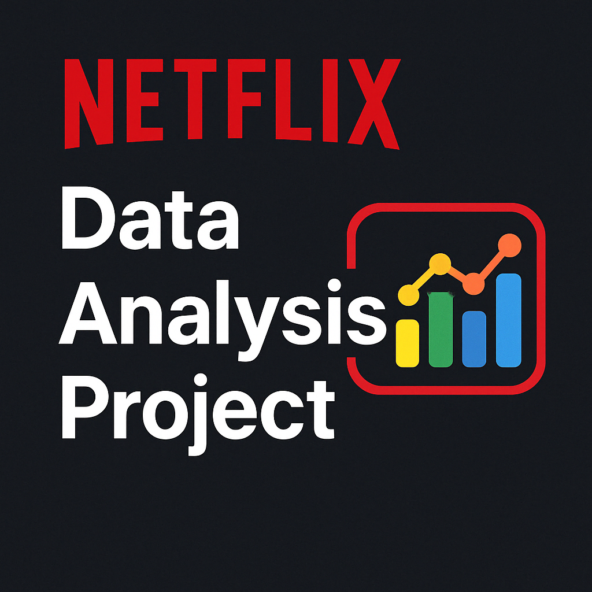

<p align="center">
  
</p>

# Netflix Data Analysis Project

[English](#english) | [中文](#chinese)

<a name="english"></a>
## English Version
📊 **Interactive Dashboard**: [View on Looker Studio](https://lookerstudio.google.com/s/vABoS93hhe0)

### 📝 Project Overview
This project is a full-cycle data analysis of Netflix's content catalog. It covers data loading, cleaning, transformation, SQL-based storage, and visualization using modern tools such as Python, MySQL, and Google Looker Studio.

The goal is to demonstrate practical data handling, pipeline creation, and reporting skills suited for fully remote data roles.

### 🧰 Tools & Technologies
- **Python**: Data processing & automation
- **pandas**: Data cleaning & transformation
- **MySQL**: Data storage and querying
- **Plotly**: Interactive data visualization
- **Looker Studio**: Dashboard creation
- **Git + GitHub**: Version control and portfolio hosting

### 📁 Project Structure
```
netflix-analysis/
├── data/
│   ├── netflix_titles.csv             # Raw data
│   └── netflix_cleaned.csv            # Cleaned data after processing
│
├── notebooks/
│   ├── 01_load_and_preview.py         # Load and inspect raw data
│   ├── 02_clean_and_format.py         # Clean and transform data
│   ├── 03_exploratory_analysis.py     # Chart from CSV
│   ├── 04_sql_analysis.py             # Chart from MySQL
│   ├── load_to_mysql.py               # Upload cleaned data to MySQL
│   ├── mysql_config.py                # MySQL connection settings
│   ├── utils.py                       # Common utilities and functions
│   └── run_all.py                     # Main pipeline execution script
│
├── .env                               # Environment variables (not in git)
├── .env.example                       # Example environment variables
├── README.md
├── requirements.txt
├── .gitignore
```

### 🔍 Key Insights Visualized
1. **Yearly Content Trend**: Number of titles added to Netflix each year
2. **Content Type Split**: Movie vs TV Show distribution
3. **Top Countries**: Countries with the most Netflix content
4. **Rating Distribution**: Content ratings (TV-MA, PG, etc.) breakdown

### 🚀 How to Use
1. Clone the repository:
   ```
   git clone https://github.com/yourusername/netflix-analysis.git
   cd netflix-analysis
   ```

2. Install dependencies:
   ```
   pip install -r requirements.txt
   ```

3. Create a `.env` file with your database credentials (see `.env.example`).

4. Run the entire pipeline with a single command:
   ```
   python notebooks/run_all.py
   ```

   This will automatically execute the complete analysis pipeline from data loading to visualization.

5. View the interactive dashboard in Looker Studio

### 🔧 Development Environment
```
OS         : macOS 14.4 (Sonoma)
Python     : 3.11 (Anaconda)
IDE        : PyCharm Professional
Database   : MySQL 8.0 (local via Terminal)
BI Tool    : Google Looker Studio (Cloud-based)
```

### 📦 Dependencies
```
pandas >= 2.0.0
plotly >= 5.0.0
mysql-connector-python >= 8.0.0
sqlalchemy >= 2.0.0
python-dotenv >= 1.0.0
notebook >= 7.0.0
```

### 📌 Author
**Chris Tsai**  
Remote-focused data analyst in training — building real-world projects with Python + SQL

### 🧭 Future Work
- Add content category segmentation analysis
- Connect to BigQuery for scalability
- Implement more advanced analytics with machine learning
- Add tracking with Google Analytics

---

<a name="chinese"></a>
## 中文版本
📊 **互動式儀表板**: [在 Looker Studio 查看](https://lookerstudio.google.com/s/vABoS93hhe0)

### 📝 專案概述
這是一個完整的 Netflix 內容目錄資料分析專案。包含資料載入、清洗、轉換、SQL 資料庫儲存以及使用現代工具（如 Python、MySQL 和 Google Looker Studio）進行視覺化分析。

專案目標是展示實用的資料處理、管道建立和報表技能，適合遠端資料分析工作。

### 🧰 工具與技術
- **Python**: 資料處理與自動化
- **pandas**: 資料清洗與轉換
- **MySQL**: 資料儲存與查詢
- **Plotly**: 互動式資料視覺化
- **Looker Studio**: 儀表板建立
- **Git + GitHub**: 版本控制與作品集展示

### 📁 專案結構
```
netflix-analysis/
├── data/
│   ├── netflix_titles.csv             # 原始資料
│   └── netflix_cleaned.csv            # 處理後的清洗資料
│
├── notebooks/
│   ├── 01_load_and_preview.py         # 載入與檢視原始資料
│   ├── 02_clean_and_format.py         # 清洗與格式化資料
│   ├── 03_exploratory_analysis.py     # 從 CSV 產生圖表
│   ├── 04_sql_analysis.py             # 從 MySQL 產生圖表
│   ├── load_to_mysql.py               # 上傳清洗資料到 MySQL
│   ├── mysql_config.py                # MySQL 連接設定
│   ├── utils.py                       # 共用工具與函數
│   └── run_all.py                     # 主流程執行腳本
│
├── .env                               # 環境變數 (不納入 git)
├── .env.example                       # 環境變數範例
├── README.md
├── requirements.txt
├── .gitignore
```

### 🔍 視覺化的關鍵洞見
1. **年度內容趨勢**: Netflix 每年新增的內容數量
2. **內容類型分布**: 電影與電視節目的比例
3. **主要國家**: 具有最多 Netflix 內容的國家
4. **分級分布**: 內容分級（TV-MA、PG 等）的明細

### 🚀 使用方法
1. 複製儲存庫:
   ```
   git clone https://github.com/yourusername/netflix-analysis.git
   cd netflix-analysis
   ```

2. 安裝相依套件:
   ```
   pip install -r requirements.txt
   ```

3. 創建包含資料庫憑證的 `.env` 檔案（參考 `.env.example`）。

4. 使用單一命令執行整個流程:
   ```
   python notebooks/run_all.py
   ```

   這將自動執行從資料載入到視覺化的完整分析流程。

5. 在 Looker Studio 查看互動式儀表板

### 🔧 開發環境
```
作業系統    : macOS 14.4 (Sonoma)
Python     : 3.11 (Anaconda)
IDE        : PyCharm Professional
資料庫      : MySQL 8.0 (透過終端機本地執行)
BI 工具    : Google Looker Studio (雲端版)
```

### 📦 相依套件
```
pandas >= 2.0.0
plotly >= 5.0.0
mysql-connector-python >= 8.0.0
sqlalchemy >= 2.0.0
python-dotenv >= 1.0.0
notebook >= 7.0.0
```

### 📌 作者
**Chris Tsai**  
專注遠端工作的資料分析師培訓生 — 使用 Python + SQL 建立真實世界的專案

### 🧭 未來工作
- 增加內容類別分析
- 連接到 BigQuery 以提高可擴展性
- 使用機器學習實現更進階的分析
- 添加 Google Analytics 追蹤

---

## 🗂 License / 授權
This project is open for educational and demonstration purposes.
本專案開放用於教育和展示目的。